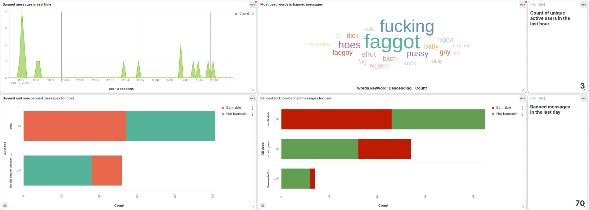

# Bannatore

Bannatore is a Telegram bot that allows automatic moderation of Telegram chat groups, using a LLM. Developed for the "Technologies for Advanced Programming" course exam, edition 2023/24, of CS degree at University of Catania.

## Application goals

Modern Telegram group chats are very crowded, but they lack of moderation. Human moderators are expensive, and are exposed to poor conditions during their moderation work (many hours also during night, and low income). This bot aims to offer an automatic and AI-powered alternative to human moderators, with less costs and better performances.

## Technologies used

### Bot logic:
- **[python-telegram-bot](https://python-telegram-bot.org/)**: A Python library that provides an interface for the Telegram Bot API.

### Data ingestion:
- **[Fluentd](https://www.fluentd.org/)**: A data ingestion technology that allow log ingestion from and to different sources.

### Data streaming:
- **[Kafka](https://kafka.apache.org/)**: Distributed event streaming platform capable of handling a high number of real-time events. 
- **Apache Spark Structured Streaming**: Stream processing engine that process data coming from Kafka using Spark DataFrame APIs.

### Centralized Service:
- **[Zookeeper](https://zookeeper.apache.org/)**: Used as a centralized service for managing and coordinating nodes within the Kafka cluster.

### Data Processing:
- **[Apache Spark](https://spark.apache.org/)**: Open-source unified, distributed analytics engine designed for large-scale data processing. 
- **[transformers](https://huggingface.co/docs/transformers/index)**: ML library provided from Huggingface for training and using pretrained transformers models.

### Data Indexing:
- **[Elasticsearch](https://www.elastic.co/elasticsearch)**: Distributed, RESTful search and analytics engine; provides efficient data indexing and storing.

### Data Visualization:
- **[Kibana](https://www.elastic.co/kibana)**: Kibana is used for creation of interactive and complex dashboard, powered by an Elasticsearch index.

## Project pipeline

## Project setup

### Downloads
- Apache Kafka: download from this [link](https://downloads.apache.org/kafka/3.7.0/kafka-3.7.0-src.tgz) and put it in kafka/setup directory.
- Apache Spark: download from this [link](https://dlcdn.apache.org/spark/spark-3.4.3/spark-3.4.3-bin-hadoop3.tgz) and put it in spark/setup directory.
- Model tapmodelv2_bert: download from this [link](https://studentiunict-my.sharepoint.com/:u:/g/personal/clbvcn02r27a638s_studium_unict_it/EaDNkoA3IidPlNv6aS0OU8EBHtXyQ5yR0282WSOuL1sy1g?e=hztBML) and extract it in spark directory.

### Application launch

- Click this [link](https://docs.docker.com/engine/install/) select your OS and follow the instructions to install Docker. If you are on Windows or MacOS, follow this [link](https://docs.docker.com/desktop/) to install Docker Desktop.

- Run `sudo apt-get update` and `sudo apt-get install docker-compose-plugin` to install Docker Compose (it's also included in Docker Desktop).

- Run `docker network create --subnet=10.0.100.0/24 tap` to create container virtual network.

- Run `docker compose up -d --build` and, after building is completed, wait about 10/15 seconds to complete the containers internal configuration.

### Results

Kibana visualizations are available at http://10.0.100.27:5601/.

